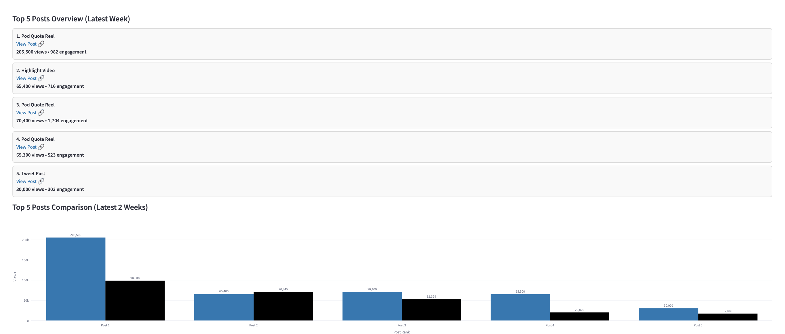

# Content Performance Dashboard
This is a streamlined dashboard for visualizing weekly performance across Facebook, TikTok, YouTube, and other platforms. I built this to replace messy spreadsheets for our small media business. It helped us quickly identify what was working, what was not working, and where to focus next. It was much more readable and accessible for all members of our team.

- [**Live Demo**](https://boomerbackfield.streamlit.app)

- 🛠️ Python • Streamlit •  Plotly

- Used internally by our startup to track social media pages with 45M+ views.

## Features

-  **Multi-Platform Analysis**: Upload weekly `.csv` exports from Facebook, TikTok, and others  
-  **Weekly Metrics Comparisons**: Compare engagement over time with line and bar charts  
-  **Highlights and Compares Top Performing Posts**: Highlights the week’s 5 best posts  
-  **Hosted By Streamlit For Accessiblity**: Simple interface for weekly updates

## Dashboard Preview

### Summary Metrics View


### Top 5 Posts Comparison



## Tech Stack

- **Frontend/UI**: [Streamlit](https://streamlit.io/)
- **Data Analysis**: Python
- **Visualization**: Plotly
- **Deployment**: Streamlit Community Cloud
- **Version Control**: Git + GitHub

## Live Demo

 **[Click here to view the live app](https://boomerbackfield.streamlit.app)**

## How to Run Locally

1. Clone this repo:
```bash
git clone https://github.com/mayjspencer/content-performance-dashboard.git
cd content-performance-dashboard
```

2. Set up a virtual environment:
```bash
python3 -m venv venv
source venv/bin/activate  # Windows: .\venv\Scripts\activate
```
3. Install dependencies:
```bash
pip install -r requirements.txt
```
4. Run the app:
```bash
streamlit run dashboard.py
```

## Sample Data

This app is designed to work with .csv files exported from platform insights (e.g., Facebook Creator Studio, X Analytics, etc.)

See the data/input folder for mock files to try the app locally.
